# Use Case Diagram - SecCollab Platform

## System Use Cases and Actor Interactions

```plantuml
@startuml SecCollab_Use_Case_Diagram

!define ACTOR(name,desc) actor name as "name\n--\ndesc"
!define USECASE(name,desc) usecase name as "name\n--\ndesc"

' Define Actors
ACTOR(RegisteredUser, "Authenticated User\nwith full system access")
ACTOR(GuestUser, "Unauthenticated User\nwith limited access")
ACTOR(Admin, "System Administrator\nwith elevated privileges")
ACTOR(FileOwner, "User who owns files\nand can manage sharing")
ACTOR(ScheduleCreator, "User who creates\nmeeting schedules")
ACTOR(EmailSystem, "External Email Service\nfor notifications")
ACTOR(OAuthProvider, "External OAuth Provider\n(Google, etc.)")
ACTOR(CloudStorage, "External Storage Service\n(Google Cloud)")

' Authentication Use Cases
package "Authentication System" {
    USECASE(UC_Register, "Register Account\nCreate new user account\nwith email verification")
    USECASE(UC_Login, "Login\nAuthenticate with\nemail/password")
    USECASE(UC_OAuth, "OAuth Login\nAuthenticate via\nGoogle/external provider")
    USECASE(UC_MFA, "Multi-Factor Auth\nSetup and verify\n2FA with TOTP")
    USECASE(UC_Logout, "Logout\nTerminate user session")
    USECASE(UC_ForgotPassword, "Forgot Password\nReset password\nvia email")
    USECASE(UC_ChangePassword, "Change Password\nUpdate user password")
}

' File Management Use Cases
package "File Management System" {
    USECASE(UC_UploadFile, "Upload File\nUpload and encrypt\nfiles to system")
    USECASE(UC_DownloadFile, "Download File\nDownload and decrypt\nuser's files")
    USECASE(UC_ShareFile, "Share File\nShare files with\nother users")
    USECASE(UC_ManagePermissions, "Manage Permissions\nSet read/write access\nfor shared files")
    USECASE(UC_DeleteFile, "Delete File\nRemove files from\nsystem")
    USECASE(UC_ViewFiles, "View Files\nList and browse\nuser's files")
    USECASE(UC_SearchFiles, "Search Files\nFind files using\nadvanced filters")
    USECASE(UC_FileActivity, "Track File Activity\nMonitor file access\nand modifications")
}

' Communication Use Cases
package "Communication System" {
    USECASE(UC_SendMessage, "Send Message\nSend text/media\nmessages to users")
    USECASE(UC_FileDiscussion, "File Discussion\nComment and discuss\nspecific files")
    USECASE(UC_ViewMessages, "View Messages\nRead message history\nwith other users")
    USECASE(UC_UploadMedia, "Upload Media\nShare images/videos\nin chat")
    USECASE(UC_RealTimeNotify, "Real-time Notifications\nReceive instant\nupdates")
}

' Scheduling Use Cases
package "Scheduling System" {
    USECASE(UC_CreateSchedule, "Create Schedule\nCreate meeting\ninvitations")
    USECASE(UC_InviteParticipants, "Invite Participants\nAdd users to\nscheduled meetings")
    USECASE(UC_RespondSchedule, "Respond to Schedule\nAccept/decline\nmeeting invitations")
    USECASE(UC_CancelSchedule, "Cancel Schedule\nCancel scheduled\nmeetings")
    USECASE(UC_ViewSchedules, "View Schedules\nList upcoming\nmeetings")
    USECASE(UC_SendNotifications, "Send Notifications\nEmail/in-app meeting\nreminders")
}

' User Management Use Cases
package "User Management System" {
    USECASE(UC_ViewProfile, "View Profile\nView user profile\ninformation")
    USECASE(UC_UpdateProfile, "Update Profile\nModify user details\nand preferences")
    USECASE(UC_ViewUsers, "View Users\nBrowse system\nuser directory")
    USECASE(UC_UserStatus, "Update Status\nSet online/away/offline\nstatus")
    USECASE(UC_ManageUsers, "Manage Users\nAdmin user\nmanagement")
}

' Security & Audit Use Cases
package "Security & Audit System" {
    USECASE(UC_AuditLogs, "View Audit Logs\nMonitor system\nactivity logs")
    USECASE(UC_SecurityScan, "Security Scan\nPerform security\nanalysis on files")
    USECASE(UC_IntegrityCheck, "Integrity Check\nVerify file\nintegrity")
    USECASE(UC_AccessControl, "Access Control\nManage user\npermissions")
    USECASE(UC_RateLimit, "Rate Limiting\nPrevent abuse\nand attacks")
}

' Real-time Features Use Cases
package "Real-time System" {
    USECASE(UC_LiveUpdates, "Live Updates\nReal-time file\nand activity updates")
    USECASE(UC_PresenceTracking, "Presence Tracking\nTrack user online\nstatus")
    USECASE(UC_InstantMessaging, "Instant Messaging\nReal-time chat\ncommunication")
    USECASE(UC_CollaborativeEditing, "Collaborative Editing\nReal-time file\ncollaboration")
}

' Actor-Use Case Relationships

' Guest User relationships
GuestUser --> UC_Register
GuestUser --> UC_Login
GuestUser --> UC_OAuth
GuestUser --> UC_ForgotPassword

' Registered User relationships
RegisteredUser --> UC_Login
RegisteredUser --> UC_Logout
RegisteredUser --> UC_MFA
RegisteredUser --> UC_ChangePassword
RegisteredUser --> UC_UploadFile
RegisteredUser --> UC_DownloadFile
RegisteredUser --> UC_ViewFiles
RegisteredUser --> UC_SearchFiles
RegisteredUser --> UC_DeleteFile
RegisteredUser --> UC_SendMessage
RegisteredUser --> UC_ViewMessages
RegisteredUser --> UC_UploadMedia
RegisteredUser --> UC_FileDiscussion
RegisteredUser --> UC_ViewProfile
RegisteredUser --> UC_UpdateProfile
RegisteredUser --> UC_ViewUsers
RegisteredUser --> UC_UserStatus
RegisteredUser --> UC_ViewSchedules
RegisteredUser --> UC_RespondSchedule
RegisteredUser --> UC_LiveUpdates
RegisteredUser --> UC_PresenceTracking
RegisteredUser --> UC_InstantMessaging

' File Owner relationships
FileOwner --> UC_ShareFile
FileOwner --> UC_ManagePermissions
FileOwner --> UC_FileActivity

' Schedule Creator relationships
ScheduleCreator --> UC_CreateSchedule
ScheduleCreator --> UC_InviteParticipants
ScheduleCreator --> UC_CancelSchedule

' Admin relationships
Admin --> UC_ManageUsers
Admin --> UC_AuditLogs
Admin --> UC_SecurityScan
Admin --> UC_IntegrityCheck
Admin --> UC_AccessControl
Admin --> UC_RateLimit

' External System relationships
EmailSystem --> UC_SendNotifications
EmailSystem --> UC_ForgotPassword
OAuthProvider --> UC_OAuth
CloudStorage --> UC_UploadFile
CloudStorage --> UC_DownloadFile

' Include relationships
UC_ShareFile .> UC_ManagePermissions : <<include>>
UC_CreateSchedule .> UC_InviteParticipants : <<include>>
UC_CreateSchedule .> UC_SendNotifications : <<include>>
UC_CancelSchedule .> UC_SendNotifications : <<include>>
UC_UploadFile .> UC_FileActivity : <<include>>
UC_DownloadFile .> UC_FileActivity : <<include>>
UC_ShareFile .> UC_FileActivity : <<include>>
UC_SendMessage .> UC_RealTimeNotify : <<include>>
UC_FileDiscussion .> UC_RealTimeNotify : <<include>>
UC_UploadFile .> UC_LiveUpdates : <<include>>
UC_ShareFile .> UC_LiveUpdates : <<include>>

' Extend relationships
UC_Login ..> UC_MFA : <<extend>>
UC_Register ..> UC_OAuth : <<extend>>
UC_UploadFile ..> UC_SecurityScan : <<extend>>
UC_DownloadFile ..> UC_IntegrityCheck : <<extend>>
UC_ViewMessages ..> UC_InstantMessaging : <<extend>>
UC_FileDiscussion ..> UC_CollaborativeEditing : <<extend>>

' Generalization relationships
RegisteredUser --|> GuestUser
FileOwner --|> RegisteredUser
ScheduleCreator --|> RegisteredUser
Admin --|> RegisteredUser

@enduml
```

## Use Case Descriptions

### 1. Authentication System

#### UC_Register - Register Account
- **Primary Actor**: Guest User
- **Preconditions**: User not registered
- **Main Flow**: 
  1. User provides email, name, password
  2. System validates input and checks uniqueness
  3. System creates account with hashed password
  4. Optional: Send verification email
- **Extensions**: OAuth registration, MFA setup

#### UC_Login - User Login
- **Primary Actor**: Guest User
- **Preconditions**: User has valid account
- **Main Flow**:
  1. User provides credentials
  2. System validates credentials
  3. System generates JWT token
  4. User gains access to system
- **Extensions**: MFA verification, OAuth login

#### UC_MFA - Multi-Factor Authentication
- **Primary Actor**: Registered User
- **Preconditions**: User has MFA enabled
- **Main Flow**:
  1. User completes primary authentication
  2. System requests TOTP code
  3. User provides TOTP from authenticator app
  4. System validates and grants access

### 2. File Management System

#### UC_UploadFile - Upload File
- **Primary Actor**: Registered User
- **Preconditions**: User authenticated
- **Main Flow**:
  1. User selects file to upload
  2. System validates file type and size
  3. System encrypts file (if enabled)
  4. System stores file (local/cloud)
  5. System creates file record
  6. System logs upload activity

#### UC_ShareFile - Share File
- **Primary Actor**: File Owner
- **Preconditions**: User owns file
- **Main Flow**:
  1. Owner selects file to share
  2. Owner selects target users
  3. Owner sets permissions (read/write)
  4. System creates share record
  5. System notifies shared users
  6. System logs sharing activity

#### UC_ManagePermissions - Manage File Permissions
- **Primary Actor**: File Owner
- **Preconditions**: File is shared
- **Main Flow**:
  1. Owner views shared file permissions
  2. Owner modifies user permissions
  3. System updates permission records
  4. System notifies affected users

### 3. Communication System

#### UC_SendMessage - Send Message
- **Primary Actor**: Registered User
- **Preconditions**: User authenticated
- **Main Flow**:
  1. User composes message
  2. User selects recipient
  3. System saves message
  4. System sends real-time notification
  5. Recipient receives message

#### UC_FileDiscussion - File Discussion
- **Primary Actor**: Registered User
- **Preconditions**: User has file access
- **Main Flow**:
  1. User selects file for discussion
  2. User posts comment/message
  3. System associates message with file
  4. System notifies other file users
  5. Real-time updates to all participants

### 4. Scheduling System

#### UC_CreateSchedule - Create Schedule
- **Primary Actor**: Schedule Creator
- **Preconditions**: User authenticated
- **Main Flow**:
  1. Creator provides meeting details
  2. Creator selects participants
  3. Creator chooses notification methods
  4. System creates schedule record
  5. System sends invitations
  6. System creates participant records

#### UC_RespondSchedule - Respond to Schedule
- **Primary Actor**: Registered User
- **Preconditions**: User invited to meeting
- **Main Flow**:
  1. User views meeting invitation
  2. User accepts or declines
  3. System updates participant status
  4. System notifies meeting creator
  5. System updates meeting status

### 5. Security & Audit System

#### UC_AuditLogs - View Audit Logs
- **Primary Actor**: Admin
- **Preconditions**: Admin privileges
- **Main Flow**:
  1. Admin accesses audit interface
  2. Admin applies filters (user, action, date)
  3. System retrieves matching log entries
  4. System displays audit information

#### UC_SecurityScan - Security Scan
- **Primary Actor**: Admin
- **Preconditions**: Admin privileges, file exists
- **Main Flow**:
  1. Admin initiates security scan
  2. System analyzes file content
  3. System checks for malware/threats
  4. System generates security report
  5. System logs scan results

### 6. Real-time System

#### UC_LiveUpdates - Live Updates
- **Primary Actor**: Registered User
- **Preconditions**: User connected via WebSocket
- **Main Flow**:
  1. System detects file/data changes
  2. System identifies affected users
  3. System broadcasts updates via WebSocket
  4. Connected users receive real-time updates
  5. UI updates automatically

#### UC_PresenceTracking - Presence Tracking
- **Primary Actor**: Registered User
- **Preconditions**: User authenticated and active
- **Main Flow**:
  1. System monitors user activity
  2. System updates user status (online/away/offline)
  3. System broadcasts status changes
  4. Other users see updated presence
  5. System handles inactivity timeouts

## Business Rules

### 1. **File Access Rules**
- Users can only access files they own or that are shared with them
- File owners can modify sharing permissions at any time
- Read-only users cannot modify shared files
- Deleted files are moved to trash before permanent deletion

### 2. **Scheduling Rules**
- Only meeting creators can cancel meetings
- Participants can accept/decline invitations
- Past meetings cannot be modified
- Email notifications are sent for all meeting changes

### 3. **Security Rules**
- All passwords must meet complexity requirements
- MFA is optional but recommended
- Failed login attempts are rate-limited
- All security-sensitive actions are logged

### 4. **Communication Rules**
- Users can only message other registered users
- File discussions are limited to users with file access
- Message history is preserved indefinitely
- Media uploads are subject to size and type restrictions
