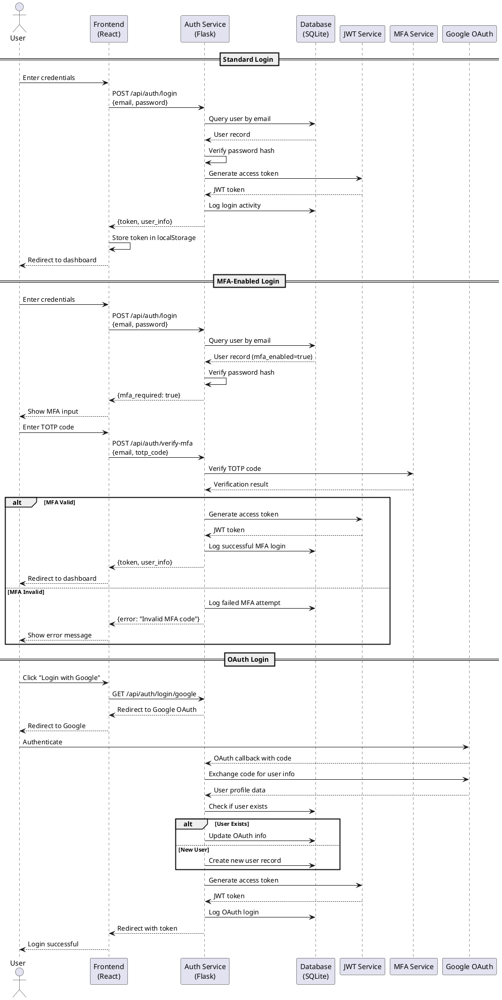
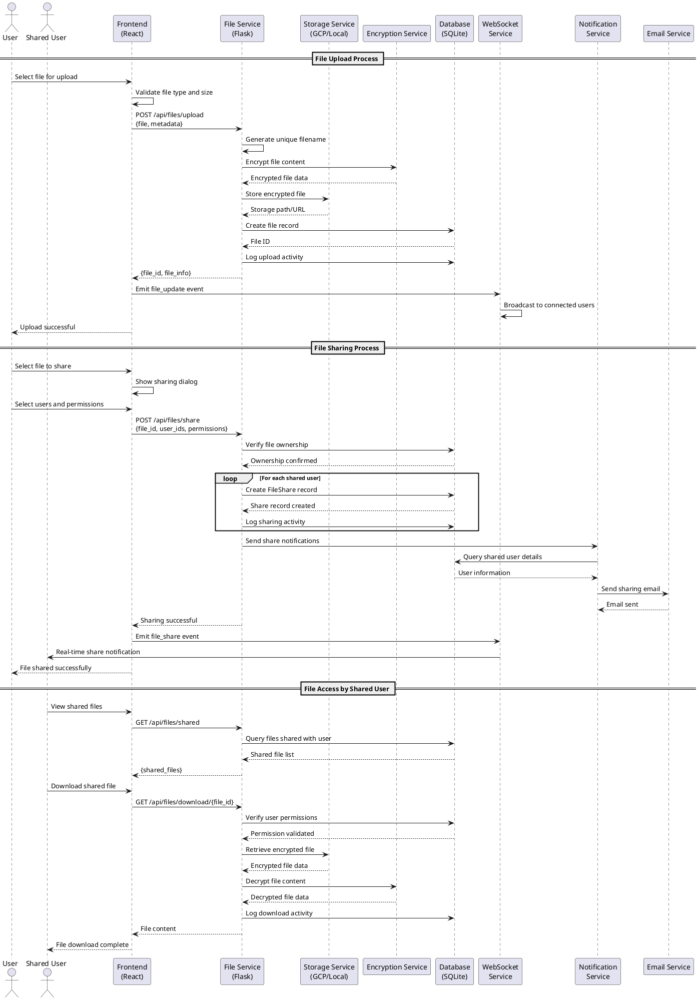
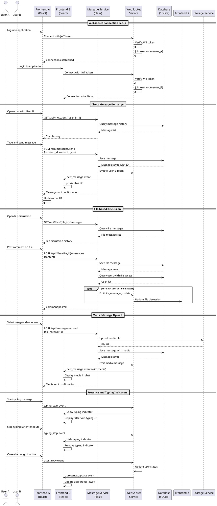
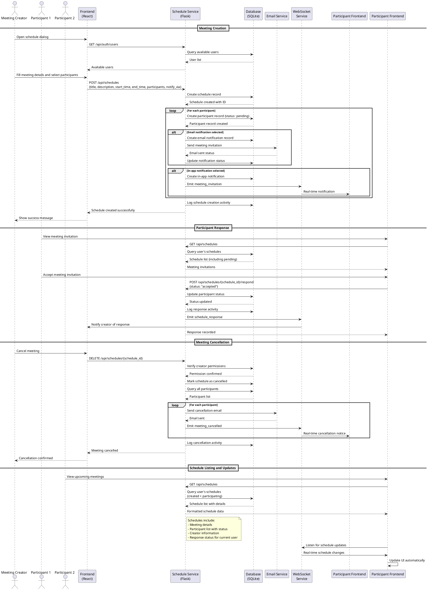
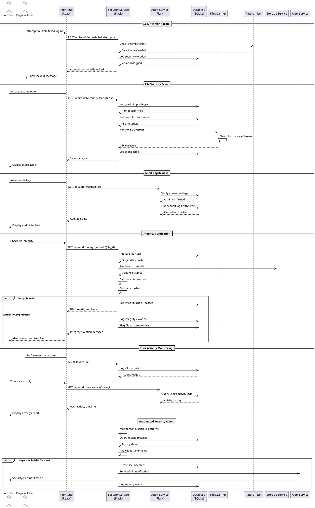

# Sequence Diagrams - SecCollab Platform

## Key Workflow Processes

### 1. User Authentication Sequence

### 2. File Upload and Sharing Sequence

### 3. Real-time Messaging Sequence

### 4. Meeting Scheduling Sequence

### 5. Security Audit and Monitoring Sequence

## Key Sequence Patterns

### 1. **Authentication Flow Pattern**
- Token-based authentication with JWT
- Optional MFA verification step
- OAuth integration for external providers
- Comprehensive activity logging

### 2. **File Operations Pattern**
- Permission verification before actions
- Encryption/decryption for sensitive files
- Real-time notifications via WebSocket
- Activity tracking for audit purposes

### 3. **Real-time Communication Pattern**
- WebSocket connections with room-based messaging
- Persistent message storage in database
- Presence tracking and typing indicators
- Media upload with file streaming

### 4. **Notification System Pattern**
- Multiple notification channels (email, in-app, WebSocket)
- Asynchronous processing for email delivery
- Real-time updates for connected users
- Fallback mechanisms for reliability

### 5. **Security and Audit Pattern**
- Comprehensive logging of all actions
- Rate limiting and abuse prevention
- File integrity verification
- Admin oversight and monitoring tools

## Error Handling Strategies

### 1. **Authentication Errors**
- Invalid credentials: Clear error messages
- Account lockout: Temporary restrictions
- Token expiration: Automatic refresh attempts
- MFA failures: Limited retry attempts

### 2. **File Operation Errors**
- Permission denied: Clear access messages
- File not found: Graceful error handling
- Storage failures: Retry mechanisms
- Upload errors: Progress and status feedback

### 3. **Communication Errors**
- WebSocket disconnection: Automatic reconnection
- Message delivery failures: Retry queues
- Network timeouts: User notifications
- Media upload failures: Progress tracking

### 4. **System Errors**
- Database connectivity: Connection pooling
- Service unavailability: Circuit breakers
- Resource exhaustion: Rate limiting
- Security violations: Immediate blocking
